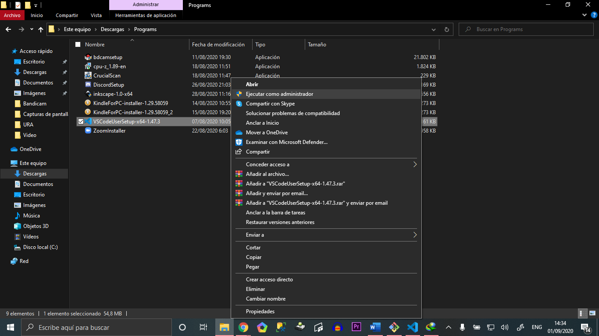
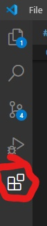
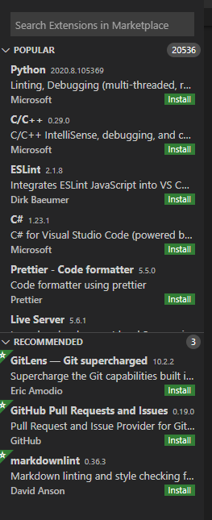
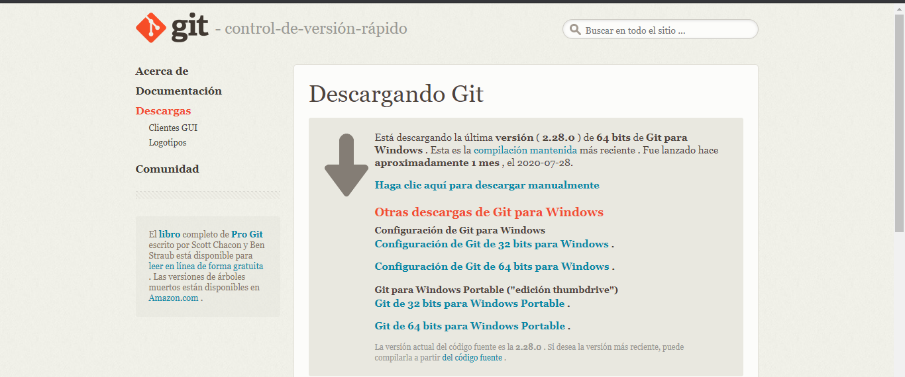
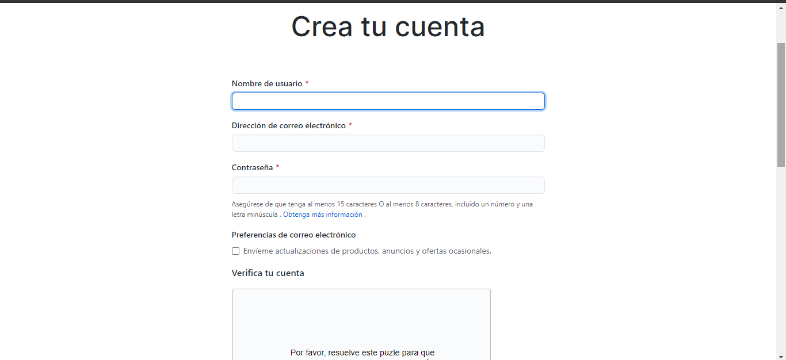
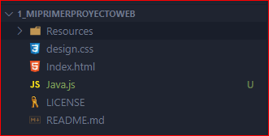

# INGENIERIA-WEB-1

Primeramente tenemos que tener descargado el instalador de nuestra pc el instalador que vamos a utilizar en este caso Visual Code.

En caso que no lo tengamos descargado lo podemos aser en este link [Visual Studio Code](https://code.visualstudio.com/download)

## Instalación de Visual code 

Dando clic derecho al ejecutable del progama que queremos instalar le damos clic en ejecutar como administrador yo en este caso ya lo tengo instalado pero luego de ahi solo le dan en siguiente varias veces hasta terminar la instalacion y finalizar . 

## Extensiones 

Para la instalacion de extensiones tenemos 2 formas ir directamente con el acceso rapido (control+shift+X) o sencillamente dando clic en el boton de extensiones que es este :

Se nos abrira este panel donde ya podremos buscar la extensión que queremos instalar solo la escribimos dando clic en search extensions in marketplace y le damos instalar.

 
Extensiones que estaremos ocupando durante el curso:

• Bracket Pair Colorizer  
• CodeSnap  
• Debugger for Chrome/Firefox/Microsoft Edge  
• EsLint  
• Live Share con Live Share Audio  
• Material Icon Theme  
• Prettier  
• Spanish Language Pack  

## Descargar e Instalar Git bash :

Para la descarga de este software los vamos a este link [Git Bash](https://git-scm.com/download/win)

Se nos mostrara esta ventana la cual nosotros descargaremos la version que vaya concorde con nuestro sistema operativo .

Luego de haber descargado el software puedo abrirlo y ejecutarlo como administrador y darle en siguiente hasta finalizar la instalación .

## Cree una cuenta de Git Hub

Para esto nos vamos al sitio oficial de [Git Hub](https://github.com/join?source=login) rellenamos los campos con nuestros datos personales verificamos que seamos personas reales y clicamos donde dice crear una cuenta y listo .

## Crear un proyecto vacío con toda la estructura de carpetas que correspondan a un proyecto web con HTML, CSS y JavaScript.
Proyecto con los ficheros de CSS,HTML y JavaScript creados con visual code en el explorador de archivos.

